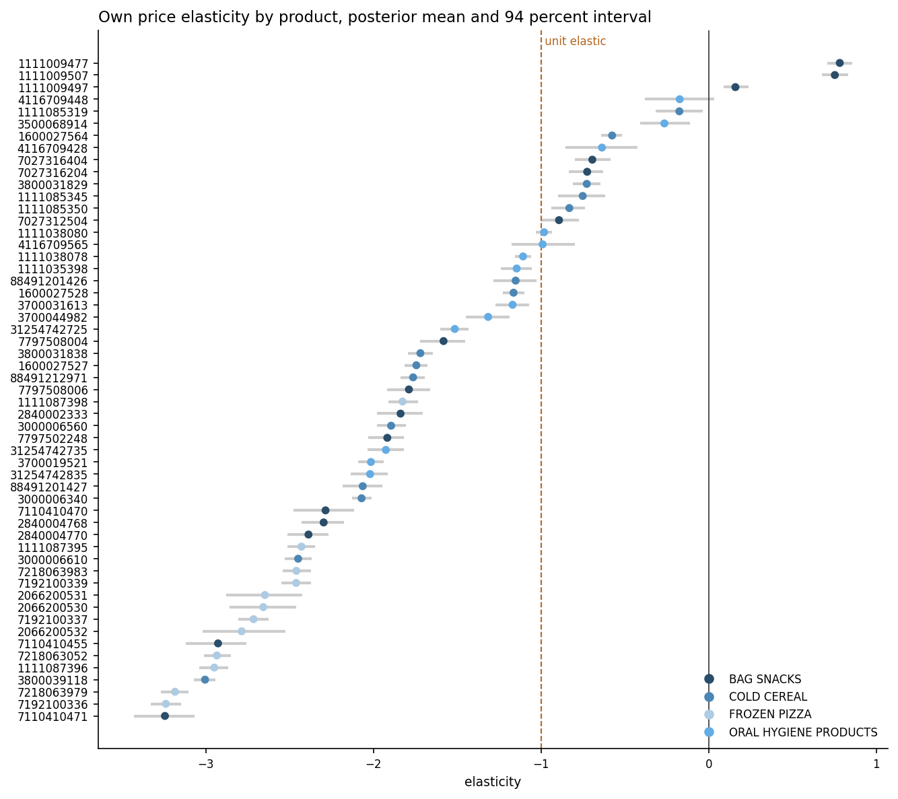
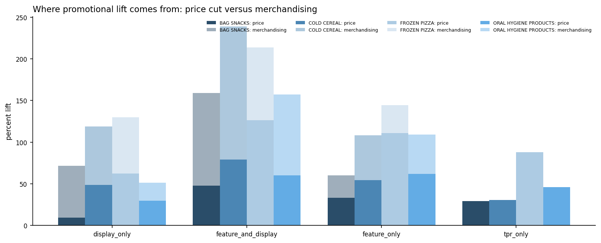
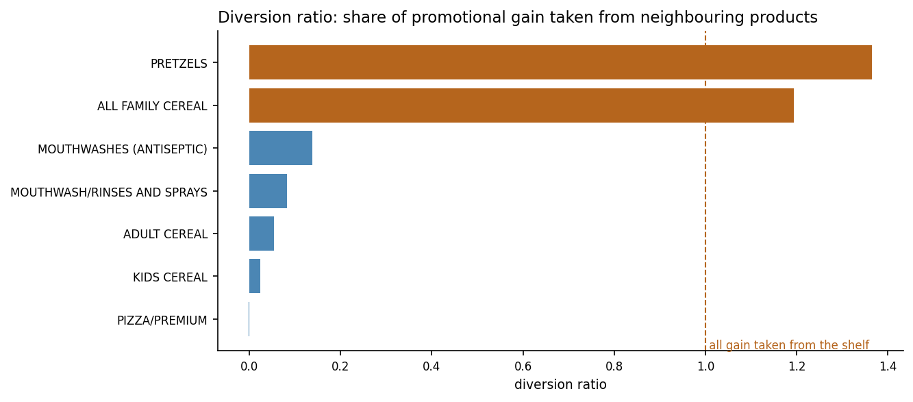
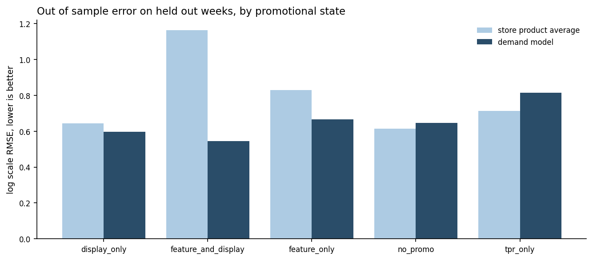

# Pricing and Promotion Optimization

[](https://github.com/JAYANSHUBADLANI/pricing-promotion-optimization/actions/workflows/tests.yml)

I estimated price elasticity of demand by product, quantified what promotions
actually buy, and turned both into a constrained discount and promotional plan
for a multi category retailer.

The short version of what I found: **most of the lift a promotion produces is
bought with shelf space rather than with margin, and on two of seven shelves the
volume a discount appears to win is taken almost entirely from the products
beside it.** A plan built on own price elasticity alone would recommend promoting
those shelves. A plan built on the shelf level response does not.

## Data

[dunnhumby "Breakfast at the Frat"](https://www.dunnhumby.com/source-files/),
a store, product and week panel of grocery sales with promotional detail.
dunnhumby describe it as nearly real world data provided for teaching. It is not
synthetic in the sense of being generated from a formula, and it is not a raw
production extract either.

| | |
| --- | --- |
| Rows | 524,950 |
| Stores | 77 |
| Products | 55 across 4 categories and 7 sub categories |
| Weeks | 156, 2009-01-14 to 2012-01-04 |
| Panel completeness | 79.5% of the full store by product by week grid |

Two properties of this file made the analysis worth doing rather than merely
possible.

**Price is given, not inferred.** Both the shelf price and the base price ship
with the data, so discount depth is measured. A common shortcut is to build a
price by dividing revenue by units, which puts units on both sides of the
regression and manufactures a negative price coefficient whether or not demand
responds to price at all. That failure mode does not arise here.

**The price column checks out against the revenue column.** Spend divided by
units reproduces the stated shelf price to within one percent on
100.0% of rows. That is
an unusually clean internal consistency result and it is the reason I was willing
to build on this file.

There is also real price variation to work with: the median store and product
pair is observed at 25
distinct prices, with a within pair price coefficient of variation of
10.9%. Elasticity is only estimable
where price moves, and here it moves.

### Promotional structure

A promotion in this data is a price cut, an in store display, a place in the
weekly circular, or a combination. The four combinations carry very different
depths, which is what makes it possible to separate what price does from what
merchandising does.

| state | store weeks | share | mean depth | mean units |
| --- | --- | --- | --- | --- |
| no_promo | 375564 | 0.715 | 0.0 | 15.134 |
| tpr_only | 70734 | 0.135 | 0.218 | 17.797 |
| display_only | 34401 | 0.066 | 0.115 | 34.014 |
| feature_and_display | 23414 | 0.045 | 0.252 | 62.587 |
| feature_only | 20837 | 0.04 | 0.228 | 34.322 |

### Cleaning

522,154 of 524,950 rows survive cleaning,
which is 99.47% of the file. Every rule and its
count is in `outputs/tables/cleaning_report.json`.

| rule | rows removed | share |
| --- | --- | --- |
| drop_missing_price | 208 | 0.0004 |
| drop_non_positive_price | 1 | 0.0 |
| drop_non_positive_units | 0 | 0.0 |
| drop_price_far_above_base | 1002 | 0.00191 |
| drop_implausible_discount | 1585 | 0.00302 |

I also found two stores duplicated in the store lookup with contradictory
segment labels, one row calling each MAINSTREAM and the other UPSCALE. Rather
than keep whichever came first, which would make the answer depend on sheet
ordering, the conflicting field is marked unresolved and recorded in
`data/interim/lookup_conflicts.json`.

## Method

The demand model is the constant elasticity form in logs, with the own price
elasticity partially pooled through three levels, product to sub category to
category, plus store effects, seasonality and separate terms for each
promotional mechanic.

Two decisions in the implementation are worth calling out.

**The likelihood runs on sufficient statistics.** The model is Gaussian and
linear in logs, so the likelihood depends on the 524,950 rows only
through `y'y`, `X'y` and `X'X`. Precomputing those makes every density evaluation
cost `O(p squared)` in the 243 coefficients rather than
`O(n)` in the rows. The test suite checks this reduction reproduces the direct
computation to nine significant figures rather than taking the algebra on trust.

**The sampler is a blocked Gibbs sampler, written for this model.** Every
conditional here is available in closed form, so a general purpose gradient
sampler has to discover numerically a geometry that can simply be written down.
In practice that showed up as a tree depth pinned at its maximum and hundreds of
divergent transitions. Drawing all 243 coefficients
jointly from their exact normal conditional instead removed the problem: no step
size, no acceptance rate, no divergences, and a fit that takes seconds. Group
scales keep half normal priors and are drawn by slice sampling, since a
conjugate inverse gamma behaves badly with only 4 categories.

Convergence: `r_hat` at most 1.010 and bulk effective
sample size at least 426 across
4,000 draws. The sampler is validated against
simulated data with known elasticities in `tests/test_gibbs.py`.

## What I found

### Elasticity varies far more across categories than within them

| category | products | mean elasticity | most elastic | least elastic |
| --- | --- | --- | --- | --- |
| BAG SNACKS | 15 | -1.39 | -3.24 | 0.78 |
| COLD CEREAL | 15 | -1.47 | -3.0 | -0.17 |
| FROZEN PIZZA | 12 | -2.69 | -3.24 | -1.83 |
| ORAL HYGIENE PRODUCTS | 13 | -1.17 | -2.02 | -0.17 |

39 of 55 products are elastic with at least 90
percent posterior probability. Frozen pizza is the standout at a mean of
-2.69;
oral hygiene is the least responsive at
-1.17.



### Promotional lift is mostly merchandising, not discount

This is the finding I did not expect. Separating the price effect from the
mechanic effect gives, averaged across categories:

| mechanic | volume effect beyond price, percent |
| --- | --- |
| display_only | 55.4 |
| feature_and_display | 114.0 |
| feature_only | 40.4 |
| tpr_only | -4.9 |

An in store display on its own is worth about
+55 percent on volume *after* its price cut is already
accounted for, and it runs at a far shallower depth than an unsupported price
cut. A display and a circular together are worth about +114
percent. A temporary price reduction with no display and no circular is worth
about -4.9 percent, meaning an unadvertised price cut
delivers slightly *less* than its own price elasticity predicts.

Across mechanics and categories, merchandising accounts for a mean
34% of modelled lift.



### On two shelves, a discount moves volume sideways rather than up

Fifteen pretzel products share a shelf. Cutting the price of one of them wins
volume that partly comes from the other fourteen rather than from new demand. The
cross price elasticity measures that, and turning it into a diversion ratio gives
the share of the headline gain that is simply moved along the shelf.

| shelf | products | cross elasticity | diversion ratio |
| --- | --- | --- | --- |
| PRETZELS | 15 | 1.185 | 1.366 |
| ALL FAMILY CEREAL | 7 | 1.564 | 1.194 |
| MOUTHWASHES (ANTISEPTIC) | 8 | 0.23 | 0.138 |
| MOUTHWASH/RINSES AND SPRAYS | 5 | 0.108 | 0.082 |
| ADULT CEREAL | 3 | 0.082 | 0.054 |
| KIDS CEREAL | 5 | 0.066 | 0.023 |
| PIZZA/PREMIUM | 12 | -0.006 | -0.002 |

A diversion ratio above 1 means more than the entire gain came off neighbouring
facings. Pretzels sit at 1.37 and all
family cereal at 1.19. Premium pizza,
by contrast, shows essentially none, so a pizza promotion creates volume rather
than relocating it.



## The recommendation

Planning happens at shelf level, so the number that matters is not the own price
elasticity but the **net elasticity**, own plus cross. When every facing on a
shelf moves together, the competing price moves with the own price, and the
shelf's response is governed by the sum.

| shelf | own | cross | net | discount | mechanic |
| --- | --- | --- | --- | --- | --- |
| ADULT CEREAL | -1.251 | 0.082 | -1.169 | 0.05 | feature_and_display |
| ALL FAMILY CEREAL | -1.074 | 1.564 | 0.489 | 0.0 | none |
| KIDS CEREAL | -2.164 | 0.066 | -2.098 | 0.05 | feature_and_display |
| MOUTHWASH/RINSES AND SPRAYS | -1.212 | 0.108 | -1.103 | 0.0 | none |
| MOUTHWASHES (ANTISEPTIC) | -1.412 | 0.23 | -1.182 | 0.0 | none |
| PIZZA/PREMIUM | -2.623 | -0.006 | -2.629 | 0.05 | feature_and_display |
| PRETZELS | -0.447 | 1.185 | 0.738 | 0.0 | none |

Promote 3 of 7 shelves:
ADULT CEREAL, KIDS CEREAL, PIZZA/PREMIUM. Shallow
depth, full merchandising support. Projected contribution change
**+56.9 percent** per store week at an assumed
35% gross margin.

2 shelves are excluded from the plan entirely, not because they are
unattractive but because their estimates are not usable: their net elasticity
comes out positive, which would mean cutting every price on the shelf reduces
volume sold. No shelf does that. It means the cross price term has absorbed the
fact that neighbouring products tend to be promoted in the same weeks. I report
the estimate and refuse to plan on it.

### How sensitive is this

No cost data ships with this dataset, so gross margin and the cost of running a
display are assumptions rather than measurements. Both are swept.

| assumed gross margin | shelves promoted | contribution change, percent |
| --- | --- | --- |
| 0.2 | 3 | 60.63 |
| 0.25 | 3 | 58.76 |
| 0.3 | 3 | 57.65 |
| 0.35 | 3 | 56.92 |
| 0.4 | 3 | 56.4 |
| 0.45 | 3 | 56.44 |
| 0.5 | 3 | 57.97 |

| merchandising cost multiplier | shelves promoted | contribution change, percent |
| --- | --- | --- |
| 0.5 | 3 | 60.61 |
| 1.0 | 3 | 56.92 |
| 2.0 | 3 | 49.54 |
| 4.0 | 3 | 34.79 |

The set of shelves worth promoting does not change across either sweep. The size
of the prize does.

## Does the model actually predict anything

I held out the final 13 weeks
(2011-10-12 to 2012-01-04), refit on the
earlier period only, and predicted volumes the model had never seen. The
benchmark is the average of the same product in the same store, which is a
strong baseline for levels and cannot respond to price at all.

Overall the model improves log scale RMSE by only
0.9 percent. That
number is close to useless on its own, because most variance in a store week
panel is cross sectional and the baseline already captures it. The informative
split is by promotional state:

| state | holdout rows | model RMSE | baseline RMSE | improvement, percent |
| --- | --- | --- | --- | --- |
| feature_and_display | 1764 | 0.544 | 1.163 | 53.215 |
| feature_only | 1626 | 0.667 | 0.831 | 19.736 |
| display_only | 1829 | 0.596 | 0.645 | 7.555 |
| no_promo | 32988 | 0.646 | 0.613 | -5.39 |
| tpr_only | 4359 | 0.815 | 0.713 | -14.324 |

The model earns its keep exactly where it should. On weeks with a display and a
circular it cuts error by
53 percent, because the
baseline has no way to know a promotion is running. On quiet weeks it is slightly
worse than the baseline, and on unadvertised price cuts it is
14 percent worse. That
last result is consistent with the negative fitted effect for that mechanic and
is the weakest part of the model.



## What I would not claim

**Promotions are not randomly assigned, so these are not causal estimates.**
Retailers put displays on products they expect to sell. Any of that anticipation
that the model does not control for lands in the mechanic effect and inflates it.
Since the recommendation leans heavily on merchandising, this is the assumption
the whole result is most exposed to. Fixing it properly needs an instrument or an
experiment, and neither is available here.

**The projected contribution change is a model output, not a forecast.** It holds
everything outside the plan constant: no competitor response, no supply
constraint, no shopper fatigue from seeing the same shelf promoted repeatedly.

**3 products come out with a positive own price elasticity.** Partial
pooling does not rescue them. They are all private label pretzels, on the shelf
with the highest cross price elasticity, which points at the own and competing
price signals being too collinear there to separate.

**Four categories and 55 products is narrow.** Three are food
and one is oral hygiene, all from one retailer, and the window is
2009 to 2012. The method carries over;
these particular elasticities do not.

**Gross margin is assumed.** The elasticity threshold at which discounting starts
to pay is exactly `-1 / gross margin`, so that assumption sets the whole
recommendation. It is swept above rather than buried.

## Running it

```bash
pip install -r requirements.txt
# place the workbook in data/raw/, then
python run_pipeline.py
```

`python run_pipeline.py --list` shows the stages. Each writes to `outputs/` and
nothing downstream reads anything a previous stage did not produce.

```bash
pytest                              # 99 tests
pytest -m slow                      # cross check the sampler against PyMC NUTS
streamlit run app/streamlit_app.py  # scenario tool
python scripts/build_readme.py      # regenerate this file from outputs
```

## Layout

```
config/config.yaml          every tunable, single source of truth
src/pricing/
  schema.py                 tolerant column mapping onto canonical names
  features.py               price, promotional state, competing price index
  data/                     workbook ingestion, verification, cleaning
  models/
    design.py               sparse design matrix and sufficient statistics
    gibbs.py                blocked Gibbs sampler
    elasticity.py           model assembly, diagnostics, output tables
    lift.py                 promotional decomposition and cannibalisation
    backtest.py             held out validation
  optimize/
    policy.py               constrained depth optimisation, closed forms
    promo.py                shelf level planning with mechanic choice
  report.py                 fitted parameters into a plan
  viz.py                    figures
app/streamlit_app.py        scenario tool
tests/                      test suite
scripts/                    README generation
```

## Licence

MIT. The dataset is dunnhumby's and carries its own terms.
